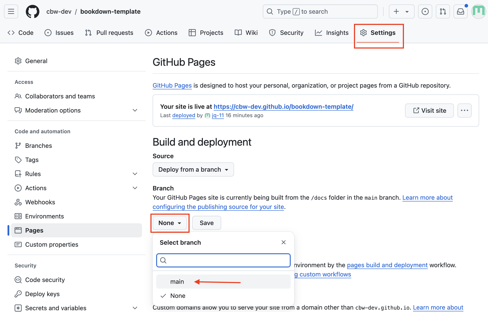

# Starting to Set Up Your **New** Workshop

Certain aspects of the setup for workshops will be different depending on your role. Headers ending in "(RC)" are for Regional Coordinators. Headers without "(RC)" are assumed to be relevant to both RC and workshop teams.

## Workshop Setup (RC)

Regional Coordinators will be tasked with creating and slightly editing each new repository for each new workshop.

1. First, let's go the [bookdown template](https://github.com/cbw-dev/bookdown-template). 

2. Click on the "Use this template" green button, which is to the left of the title of the repository "bookdown-template". Then, press the dropdown option: "Create a new repository", as seen below.

\
  <!-- enforces a space after the image -->

3. You will be brought to a "Create a new repository" page. Fill out the blanks as seen below. That is, change the owner to XXX, make it public, fill in the repository name and description according to [CBW Guidelines]().  "Include all branches" does not need to be selected (???).

NOTE: CHANGE OWNER TO XXX (ask Nia, probably cbw-dev for now)
\
 

This may take a couple seconds to generate. After it loads, you will be brought to a new repository for the new workshop!

Now, let's turn this into a website - let's deploy!

### How to Deploy Your Workshop Website

1. In the top navigation bar, select settings.

2. Then, go to the pages sidebar.

3. "Deploy from a branch" is already selected, which is what we want. We must change the branch from "none" to main.

4. Then, change the folder from `/ root` to `/docs`. Then press save.
\

Great! Now we're waiting on the page to build and deploy, which should take less than a minute.

To see updates, go to the **Actions** page (found along the top navigation bar. This will help you understand how the deploy is working, and if it succeeded or failed.

\

You can click <u>**pages build and deployment**</u> for updates. It will give you errors (which may not be very clear) or the link of your deployed page!

\
\

## Setting Up Team Access (Nia will fill this in)

## Getting the Template on Your Local Computer - Git Clone

1. navigate to where in your local file system you want to have your workshop in (hint: cd)

2. git clone git@github.com:jq-11/workshop-name.git

3. ready to go ! you should have permissions to git push

>NOTE: Consider having only one team member (or perhaps your RC) make git pushes or control pull requests. To avoid merge conflicts, designate 1 team member to control actual changes to your workshop repo. Other team members can fork or create branches, and create a pull request that the designated team member can check and overlook.

But what do any of these files mean? Which ones do I edit? Which ones shouldn't I edit? How do I open this in RStudio? It's time for you to go to the next page :D

## File Setup Explanation

Explain file setup (tree diagram?)
