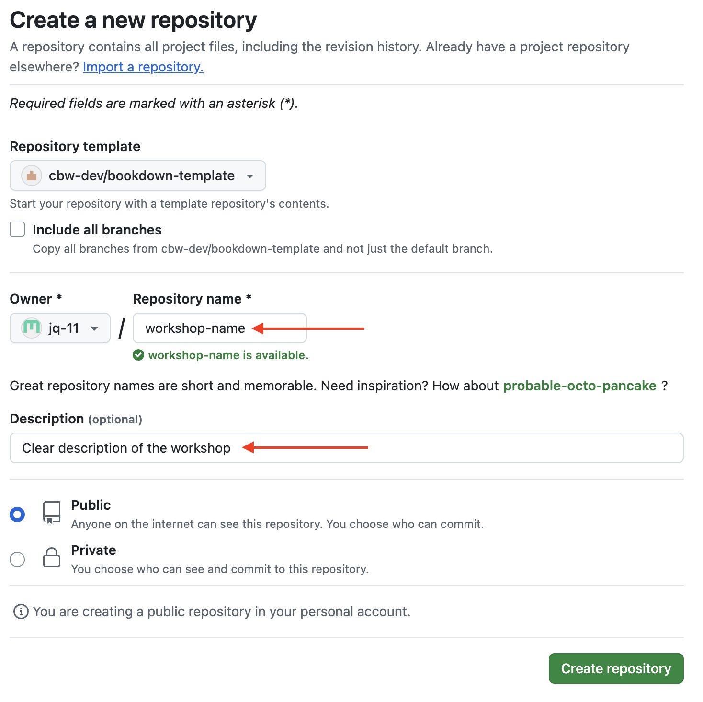
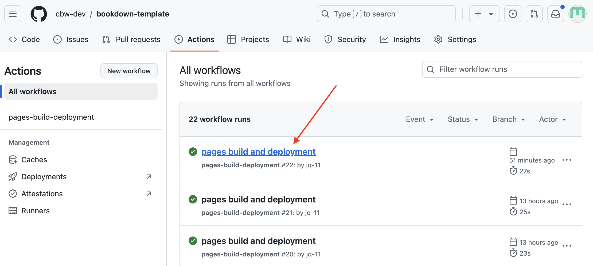

# **New Workshop**: Creation [RC] and Deployment

Certain aspects of the setup for workshops will be different depending on your role. Headers ending in "[RC]" are for Regional Coordinators. Headers without "[RC]" are assumed to be relevant to both RC and workshop teams.

## Setup the Workshop [RC] {#rc-workshop-setup}

1. First, let's go to the <a href="https://github.com/cbw-dev/bookdown-template" target="_blank">bookdown template</a>.

2. Click on the "Use this template" green button, which is to the left of the title of the repository "bookdown-template". Then, press the dropdown option: "Create a new repository", as seen below.

    \
      <!-- enforces a space after the image -->

3. You will be brought to a "Create a new repository" page. Fill out the blanks as seen below. That is, change the owner to "bioinformatics.ca" [NOTE FOR TESTING PURPOSES: use cbw-dev], make it public, fill in the repository name and description according to [CBW Guidelines]().  "Include all branches" does not need to be selected.
    
    \
     

    This may take a couple seconds to generate. After it loads, you will be brought to a new repository for the new workshop!
    
    Now, let's turn this into a website - let's deploy!

### Workshop Repo VS Workshop Website

Now, you have made a repository that holds what GitHub needs to make our website (the basic workshop template). Essentially, the template has already been configured so that the html files that make up our website go into a folder called `docs`. We need to tell GitHub to look at the `docs` folder to find our website files and make it available to see online (a.k.a deploy it).

> Distinction:
>
> GitHub (ex. https://github.com/cbw-dev/bookdown-template) holds your repo, which has version control for all your files!   The deployed website (ex. https://cbw-dev.github.io/bookdown-template/) has the workshop online.

### How to Deploy Your Workshop Website {#deploy-website}

1. In the top navigation bar, select settings.

2. Then, go to the pages sidebar.

3. "Deploy from a branch" is already selected, which is what we want. We must change the branch from "none" to "main". Select the "None" dropdown button and select "main".
\

4. Then, change the folder from `/ root` to `/docs`. Then **press save**.
\
    
    Great! Now we're waiting on the page to build and deploy, which should take less than a minute.
  
## Check Your Deploy and See your Website! {#check-deploy}
        
To see updates, go to the **Actions** page (found along the top navigation bar. This will help you understand how the deploy is working, and if it succeeded or failed.

\

You can click <u>**pages build and deployment**</u> for updates.

A successful deploy will have a green checkmark next to it. You can inspect the 3 steps: build, report-build-status, deploy. Once it's done deploying, you can find the website at the link provided under "deploy"!

\

A failed deploy will have a red cross next to it. Clicking through the steps can help you determine what went wrong in the deploy.

> Warning: A website can build properly, but may not deploy properly! It is a good idea to check after making big changes.

\

#### A Very Specific Build and Deployment Warning {-}

\

This is a very specific (and unlikely) warning. It occurs when 1 deploy hasn't finished, but another deploy began. THIS IS NOT A CONCERN. This is a warning message you do not have to worry about!

## Setting Up Team Access [RC?] (Nia will fill this in)
