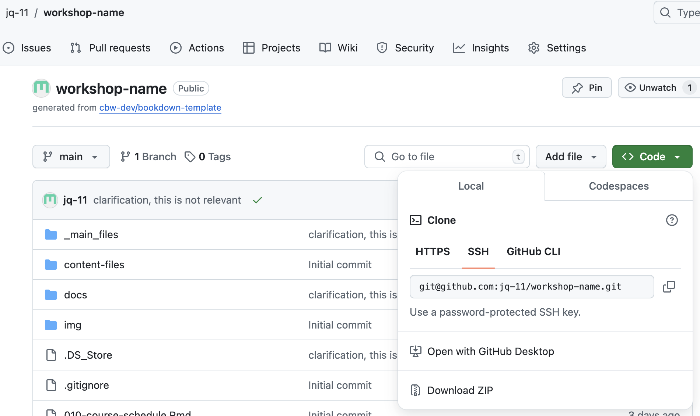

# Command Line, SSH Connection & Git Clone

If you're familiar with the command line and have already established a SSH connection, continue to [git cloning your workshop template locally](#git-clone).

## Introduction to the Command Line

This is for those who have no (or extremely little) experience with the command line.

Using the command line, you can use text commands to interact with your computer's operating system. For us, we will be using it to move around our folders and to [git clone](#git-clone) our workshop into our computer, so we can work on it using RStudio!

> Note:
>
> Do not be worried about using terminal, espeically git commands in terminal! Once we are all setup, we will never have to touch the terminal and write these commands again!

### Terminal, Command Prompt and Windows PowerShell

We can use the command line using certain tools and applications. Terminal is a Unix-based (meaning Linux and macOS computer already have it) application that allows you to access the command line. Similarly, Command Prompt (CMD) and Windows PowerShell give access to the command line on Windows computers. However, Terminal, Command Prompt and Windows PowerShell differ in what commands are accepted. The same commands we give to Terminal may not work in Command Prompt and/or Windows PowerShell.

> Note: Windows PowerShell tends to be more advanced than Command Prompt, and often can accept more commands that are accepted by Terminal than Command Prompt.

### Common Commands (for us)

<!-- Consider making this explanation a video -->

We won't need to know that many commands, but for easy navigation and understanding, here is what you (generally) need:

:::: {.greenbox data-latex=""}
**Note:**

Commands are written below as headers, with an explanation provided beneath.

They follow the format: "[Linux Command] OR "[Windows Command]"
::::

###### pwd OR echo %cd% {.unnumbered}

"pwd" stands for "print working directory". It is a command that works in **Linux** and **Windows PowerShell**. The equivalent in **Command Prompt** is "echo %cd%". For example, below our output is where in my folders the current .Rmd file that makes up this website is:

```{bash}
pwd
```

###### ls OR dir {.unnumbered}

"ls" is a command that works in **Linux** and **Windows PowerShell**. It's short for "list" and outputs all the files and folders in the directory (folder) you are currently in. (Note: this code only shows 4 files to save space!)

```{bash, results='hide'}
ls
```

<!-- to save space, only output the first 4 lines -->

```{bash, echo=FALSE}
ls | head -n 4
```

A similar command in **Command Prompt** is `dir` (short for "directory"), which also outputs the files and folders in your current directory (along with timestamps)!

###### cd {.unnumbered}

"cd" stands for "change directory". The command produces no output, but it allows you to go to a different directory than the one you're currently in. For example,

```{bash}
pwd # recall: pwd tells us where we currently are
cd img # img is a folder in bookdown-docs
echo "now switching directories" # outputs the following string
pwd
```

> **Tip**:<br>Typing "cd" and then hitting the `tab` key will give you the available directories you can go to from where you are, or what you have currently typed in. If there is only one option, hitting `tab` will fill in your command with that option. (This works when typing in any file location into your command line, not only using "cd"). On macOS, the terminal will give you a list if there are multiple options. On Windows, both Command Prompt and Windows Powershell will fill in potential options, and you can hit tab multiple times untill you find your desired file destination.

**File Location Shorthands** When referring to file addresses, there are helpful shorthands! Here's a summary: - `.` = Current Directory - `..` = Parent Directory - `~` = Home Directory

Here's an example (recall, cd produces no output!):

```{bash}
pwd
echo -e # creates a line

echo "Current Directory Example"
cd .
pwd
echo -e

echo "Parent Directory Example"
cd ..
pwd
echo -e

echo "Home Directory Example"
cd ~
pwd
```

###### mkdir {.unnumbered}

"mkdir [directory address]" stands for "make directory". Essentially, mkdir will make an empty directory (folder) at a specified location. For example: `mkdir test` would create a folder named "test" in our current directory. The following commands do the same thing. Note: `mkdir ./test` does the same thing.

###### rmdir {.unnumbered}

"rmdir [directory address]" removes an *empty* directory. For example, `rmdir test` would delete the directory we just made!

###### rmdir -r OR rmdir /s {.unnumbered}

"rmdir -r [directory address]" (Terminal & Windows PowerShell) and "rmdir /s [directory address]" removes a directory recursively, meaning it deletes all the contents of the folder as we all as the folder in itself. Be careful, you can not restore a directory you removed using "rmdir"!

###### Up [⬆] and Down [⬇] Arrows {.unnumbered}

One of the most useful tips for using the command line is to use your up [↑] and down [↓] arrow keys. Using the up [↑] key gives you the previous commands you typed, and the down [↓] arrow returns you to your earlier commands.

## Creating the SSH Connection

We need to create an SSH connection. You have already set this up if you have been git cloning, pulling from and pushing to GitHub. If you have, continue to [git cloning](#git-clone). If you haven't, keep reading!

Essentially, we're doing these steps to update and receive updates from our GitHub repository, with security!

Follow the following 3 main steps. Each of these subheaders links to GitHub's official docs, if you would prefer to follow them instead! (Below is the simplified version of the instructions, if you've already been working with GitHub/SSH connection and want to make a new one, consider using the official docs.) The official docs may be more up-to-date. 

*If you do decide to use GitHub's docs,* ***choose the page*** *(the different tabs are clickable at the top of the page) that matches your system (Mac/Windows/Linux).*

> Note: You can do these commands anywhere in your files. You do not need to be in your home directory.

:::: {.bluebox data-latex=""}
::: {.center data-latex=""}
**Output VS Commands**
:::

In our instructions (and the GitHub docs), output is prefaced by a "\>" sign.

In the GitHub instructions, commands start with "\$" sign. In Linux, the terminal tends to give you a "\$" to indicate where to run your command. Thus, GitHub uses a "\$" to indicate that what comes after is the command you should run. **The "\$" is not part of the command.** (We do not do this in our instructions).
::::

### <a href="https://docs.github.com/en/authentication/connecting-to-github-with-ssh/generating-a-new-ssh-key-and-adding-it-to-the-ssh-agent#generating-a-new-ssh-key)" target="_blank">Generating a new SSH key</a>

1.  Open Terminal.

2.  Copy and paste this text into your terminal. **Replace the email given below with your GitHub email address** (the email address you used to sign up for Github). *Keep the quotations in your command.* Press enter to run the command.

    ```bash
    ssh-keygen -t ed25519 -C "your_email@example.com"
    ```

    You will get this output:
    
    ```
    > Generating public/private ALGORITHM key pair.
    > Enter a file in which to save the key (/Users/YOU/.ssh/id_ALGORITHM):
    ```
    
    Press enter. (This uses a default file and default file location.)
    
    If you have already created a SSH key and you are asked to rewrite another key, look at the <a href="https://docs.github.com/en/authentication/connecting-to-github-with-ssh/generating-a-new-ssh-key-and-adding-it-to-the-ssh-agent#generating-a-new-ssh-key:~:text=Please%20note%20that%20if%20you%20created%20SSH%20keys%20previously%2C%20ssh%2Dkeygen%20may%20ask%20you%20to%20rewrite%20another%20key%2C%20in%20which%20case%20we%20recommend%20creating%20a%20custom%2Dnamed%20SSH%20key.%20To%20do%20so%2C%20type%20the%20default%20file%20location%20and%20replace%20id_ALGORITHM%20with%20your%20custom%20key%20name." target="_blank">GitHub Docs</a> for specific steps.

3.  Type a secure passphrase (make up a password) when prompted with:
    
    ```         
    > Enter passphrase (empty for no passphrase): [TYPE YOUR PASSPHRASE]
    ```
    
    :::: {.redbox data-latex=""}
    ::: {.center data-latex=""}
    **Before you freak out,**
    :::
    
    this passphrase is so secretive that won't see it being typed. You won't see a cursor moving and you won't see ● instead of the characters you're typing. Rest assured, your computer is receiving your text.
    
    If you make a mistake, it's best to hit the "delete" bar many times, and retype. 
    ::::
    
    ```
    > Enter same passphrase again: [TYPE THE SAME PASSPHRASE]
    ```
    
    > You should keep note of this passphrase for your own use. We (should) never have to use it again after finishing these steps.
    
    You will get specific output telling you information about your public key and key fingerprint. This is specific to the SSH connection you just made!
    
### <a href="https://docs.github.com/en/authentication/connecting-to-github-with-ssh/generating-a-new-ssh-key-and-adding-it-to-the-ssh-agent?platform=mac#adding-your-ssh-key-to-the-ssh-agent" target="_blank">[Linux/Mac] Adding your SSH key to the ssh-agent</a>

These are the instructions if you have a Linux or macOS computer. Go [here](#windows-add-ssh-key) for the Windows instructions.

1.  In terminal, run the following command:

    ```bash         
    eval "$(ssh-agent -s)"
    ```

    You will get this output:

    ```         
    > Agent pid 59566
    ```
    
    *(Your number will most likely be different than the one above.)*

2.  If you're using macOS Sierra 10.12.2 or later additions, you need to modify your `~/.ssh/config` file.

    1.  Check if you have a `~/.ssh/config` file: Run the following command:

        ```bash
        open ~/.ssh/config
        ```

    2.  If you get the following output:

        ```         
        > The file /Users/YOU/.ssh/config does not exist.
        ```

        Create the file using the touch command: run the command given below

        ```bash         
        touch ~/.ssh/config
        ```

    3.  Edit your `~/.ssh/config` file using the following instructions. (You can use any text editor you would like, such as vim). Below we use nano as a text editor.

        -   Run `nano ~/.ssh/config`
        -   Add the following lines to this file.

        ```         
        Host github.com
         AddKeysToAgent yes
         UseKeychain yes
         IdentityFile ~/.ssh/id_ed25519
        ```

        -   Exit nano: `ctrl + X`
        -   Type "Y" and hit enter to save changes, when asked the following

        ```
        Save modified buffer (ANSWERING "No" WILL DESTROY CHANGES) ?
        ```

3.  Return to terminal. Run the following command:

    ```bash
    ssh-add --apple-use-keychain ~/.ssh/id_ed25519
    ```
    
    (You may be asked to enter your passphrase again. This is the same passphrase as before.)

### <a href="https://docs.github.com/en/authentication/connecting-to-github-with-ssh/generating-a-new-ssh-key-and-adding-it-to-the-ssh-agent?platform=windows#adding-your-ssh-key-to-the-ssh-agent" target="_blank">[Windows] Adding your SSH key to the ssh-agent</a> {#windows-add-ssh-key}

1. Right click on Windows Powershell (you can search for it in your search bar on your taskbar) and select "Run as administrator".

2. Run the following commands:

    ```bash
    Get-Service -Name ssh-agent | Set-Service -StartupType Manual
    ```
    ```bash
    Start-Service ssh-agent
    ```
3. Open a terminal window (without running as administrator). Run the following command, and **replace YOU with your GitHub username**:

    ```bash
    ssh-add c:/Users/YOU/.ssh/id_ed25519
    ```

### <a href="https://docs.github.com/en/authentication/connecting-to-github-with-ssh/adding-a-new-ssh-key-to-your-github-account#adding-a-new-ssh-key-to-your-account" target="_blank">Adding a new SSH key to your account</a>

1.  Copy the SSH public key: Run the following command to copy the content of the \~/.ssh/id_ed25519.pub file to your clipboard:

    **On Mac/Linux:**
    
    ```bash
    pbcopy < ~/.ssh/id_ed25519.pub
    ```
    
    **On Windows:**
    
    ```bash
    clip < ~/.ssh/id_ed25519.pub
    ```


2.  Go to your GitHub account on the <a href="https://github.com/" target="_blank">GitHub</a> website. Click on your profile picture (icon in the upper right). Then, select **Settings**.

3.  Under the "Access" section, click **SSH and GPG keys**.

4.  Click **New SSH key** or **Add SSH key**.

5.  In the "Title" field, add a descriptive label for this key you are creating (ex. if this is your personal laptop, you can call the key: "Personal Laptop").

6.  Leave the type of key as "authentication" (rather than "signing"). For our purposes, selecting authentication is fine.

7.  In the "Key" field, paste (we are pasting what we copied in step 1).

8.  Click **Add SSH Key**.

9.  If you are prompted, confirm access to your GitHub account.

Finally, we're all done! We've created a SSH connection between your device and GitHub!

Thankfully, we only need to do these steps once! Additionally, most security questions are only asked the first time, so when you work on your workshop in the future, you will not have to redo these steps or confirm authentication.

## Getting the Template on Your Local Computer - Git Clone! {#git-clone}

1.  Navigate to where in your local file system you want to have your workshop in (hint: cd + `tab`).

2.  Return to your workshop repository on GitHub.

    Find the ssh for your workshop repository:
    
      - First, click the green button entitled `< > Code` ands see the drop down options.
      - Click the SSH tab, as seen below, and then copy the text below it. The text should be something like [git\@github.com](mailto:git@github.com){.email}:bioinformaticsdotca/WORKSHOP-NAME.git, as seen below.

    \

    Then put the following command into your command line, within the folder you want the workshop folder to be in. (For example, if my organization is named: jq-11 and my workshop name is "workshop-name", I would enter this into my terminal.)

    ```         
    git clone git@github.com:jq-11/workshop-name.git
    ```

3.  You should be ready to go! With your given permissions, you should be able to git push (put your local edits on GitHub) and git pull (pull edits on GitHub to your local computer) fine!

> NOTE: Consider having only one team member (or perhaps your RC) make git pushes or control pull requests. To avoid merge conflicts, designate 1 team member to control actual changes to your workshop repo. Other team members can fork or create branches, and create a pull request that the designated team member can check and overlook.

But what do any of these files mean? Which ones do I edit? Which ones shouldn't I edit? How do I open this in RStudio? And how exactly is a page made from all these files??? It's time for you to go to the next page :D
