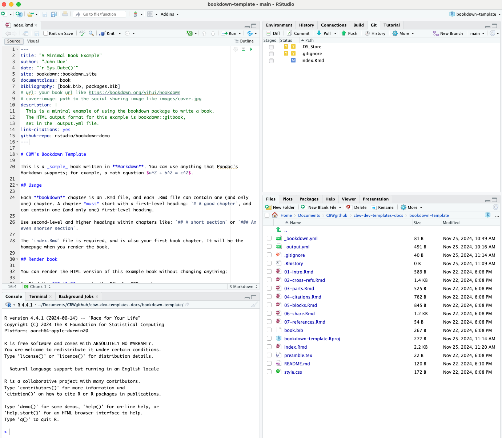
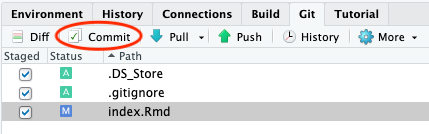

# So What Do These Files Mean?

Ok now we have our workshop locally (on our computer), which is made up of all these files and folders?

Before we dive deep into what to do with these folders, let's explore how bookdown actually works and how to understand RStudio.

## Bookdown Simple Explanation

Here is a general summary of how Bookdown creates html websites from .Rmd files.


Essentially, knitr renders and runs all the code, and the outputs are converted into markdown. After knitr, we essentially have a bunch of only markdown files.

Pandoc translates this markdown into html, so that we get a website! It can be helpful to know when and how these packages work, to help debug later on!

Now, let's figure out RStudio. Skip to [file setup](#file-setup) if you already know how to use RStudio (and it's built in git control window).

## Open in RStudio

Enter the folder you just git cloned using Findr/File Command, it should be titled "[workshop-name]". Right click on [workshop-name].Rproj and press "Open in RStudio". There is only one file with this file extension. The .Rproj file is what you will open each time you want to work on this workshop! You must explicitly **open the .Rproj** file to build properly!

A RStudio window should open up and look something like the image below. 
\

## Explaining RStudio

In the bottom left, have our console and other debug related windows (such as terminal!). Any code we run will appear in the console. We can access the terminal (just like editing in the Terminal app) under the "Terminal" tab.

In the bottom right, we have all of our files and subfolders. These files will be explained [below](#file-setup). This window also contains helpful views, like "Viewer" and "Plots". We will touch on these later.

Try opening `index.Rmd`: a new pane will open in the top left that shows the contents of `index.Rmd`. This is where we will be editing our files! Notice, the "Knit" button.

In your top right, we have a different window with more different views. The most relevant windows to us are the "Build" and the "Git" windows. 

> No "Git" Window?
>
> Try closing (and maybe even restarting RStudio) and then reopening it. A "Git" tab should appear to the right of the "Build" tab and to the left of the "Tutorial" tab.

## Build the book

Try pressing "Build Book" within the "Build" window. Your build window is going to fill up with text, and soon, a website is going to pop-up as your new window. This is the website you will be editing to create your workshop!

By building the book, all of these files were compiled and converted to .html files, that create a website. Each time we make local changes to our files and we want them to appear in our website, we need to rebuild the book. Note that each time we build our book, the files we edited will be saved first (we don't have to save before building!). 

### Other Ways to Build Your Book

1. Build the book from the R console:

```{r, eval=FALSE}
bookdown::render_book()
```

2. Press the keyboard buttons: `cmd + shift + B` (macOS) OR `ctrl + shift + B` (windows)

### Knit Your Book
Building can take a long time. If you are editing just one file, you can press the "Knit" button that is at the top of the window with your file. This will run the code in the page, and show you what that page would look like in the website (as well as saving that file).

> Note: Other pages in your website will not update.

> A quicker way to knit is using the keboard controls
>
> `cmd + shift + K` (macOS) OR `ctrl + shift + K` (Windows)

### Preview Your Book

If you want live updates to your changes, you can preview the page as you edit the book when you save individual .Rmd files. You can start the server in a work session by using the RStudio add-in "Preview book", or from the R console (in the bottom left window):

```{r eval=FALSE}
bookdown::serve_book()
```

But which files do we edit? Well alas, it's time to discuss the file setup.

## File Setup Explanation {#file-setup}

Here is a tree diagram of the bookdown template setup. (Note that this mimics how RStudio displays the files, if your RStudio shows these template files in a different order, right click your file window and press "Reload")

<!-- PLEASE DO NOT DELETE THIS TREE DIAGRAM, I (Julia) FORMATTED some of IT MYSELF, PLEASE DO NOT DELETE UNLESS A BETTER TREE DIAGRAM THAT IS IN THE SAME ORDER AS HOW RSTUDIO ORDERS IT IS FOUND -->

```
bookdown-template
├── _404.md
├── _bookdown.yml
├── _bookdown_files
├── _main_files # image and pdf output files
├── _output.yml
├── .gitignore
├── .Rhistory
├── 010-course-schedule.Rmd
├── 011-content-files.Rmd
├── 012-meet-your-fac.Rmd
├── 020-module-1.Rmd
├── 030-module-2.Rmd
├── README.md
├── book.bib
├── bookdown-template.Rproj
├── content-files
    └── sample-pdf.pdf
├── docs
    └── [html files & other generated content]
├── img
    ├── bioinformatics.ca-logo.svg
    ├── faculty
        ├── michelle-brazas.jpg
        └── nia-hughes.jpeg
    ├── favicon.ico
    └── sponsors
         └── Your-Sponsor-Here.svg
├── index.Rmd
├── packages.bib
├── preamble.tex
└── style.css
```

Look at all these .Rmd files! Recall that .Rmd -> .md -> .html files (from the diagram earlier). Hence, most of the files we really need to edit or create more of are .Rmd files.

However, 2 other important files are the `_output.yml` files and the `_bookdown.yml` files. They help tell bookdown what we want and what to do, especially when making our website. Everything you need to edit here is made clear in the template, so do not worry too much about getting the ride code so that your project builds!

The only .Rmd that must have some configuration details is the landing page: index.Rmd. This is what fills up the beginning of the index.Rmd file, before the \-\-\-, which tells bookdown to stop looking for configuration information.

Let's move on to discussing the breakdown of the .Rmd files. Each new page is defined by a new header, which starts with #, each subheaders have increasingly more # symbols (##, ###, and more all create smaller subheaders). Try to have only 1 single # as a header on one page! (You may get warnings otherwise).

But then how does bookdown know which page goes next on our sidebar? The order of the sidebar is completely dependent on the alphaetical order of the files (see your bottom right!). Our template has numbering first, to help ease our understanding.


<!-- "By default, users will be directed to a 404 page if they try to access a webpage that cannot be found. If you'd like to customize your 404 page instead of using the default, you may add either a `_404.Rmd` or `_404.md` file to your project root and use code and/or Markdown syntax." -->

## Push to GitHub via RStudio

Now, we know what our files mean and how to edit them. How do we get this onto GitHub? We can write git commands into our Terminal/Command Prompt, or alternatively (and more easily), RStudio has a built-in git interface.

Now, we will be able to see a Git window in the top right. Click "Git" to open this window.



Let's say we only edited `index.Rmd`, now we see the newly edited files. Changed files that need to be updated on GitHub will show up in this window, like how `index.Rmd` is seen above. (Do not worry too much about `.DS_Store` and `.gitignore` do.) Let's try to push this change to GitHub.

13. Select all the edited files.

\

14. Then, click the Commit button, which appears above your selected items. A window pane will appear (shown below).

\

15. Add a commit message in the corresponding box, and then press commit below it.

16. A new window will show up, detailing your updates. Close this window and then press **Push** to push your updates to GitHub.

\

Now, we're done! We should see the updates on GitHub now. Also note, if we ever want to pull updates from GitHub, there is also a **Pull** button in the Git window within RStudio! 

*Git pushing* puts your edits onto GitHub, *git pulling* takes the edits make on GitHub, and brings them to your local computer. For example, if one of your workshop team members made an edit, you want to have that edit on your computer before you start editing! It's a good idea to do this before you start editing, in case somehow your edits conflicts with their edits.

Git pushing will automatically update the website, you can see the updates and progress in the actions window we saw previously. (Check out your website on the web once it's done deploying!)

