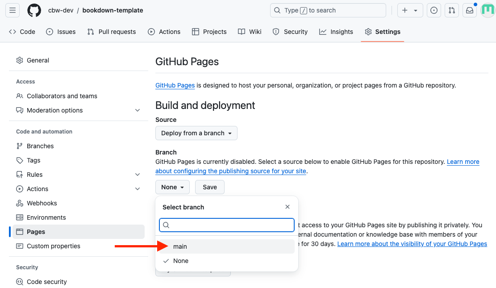
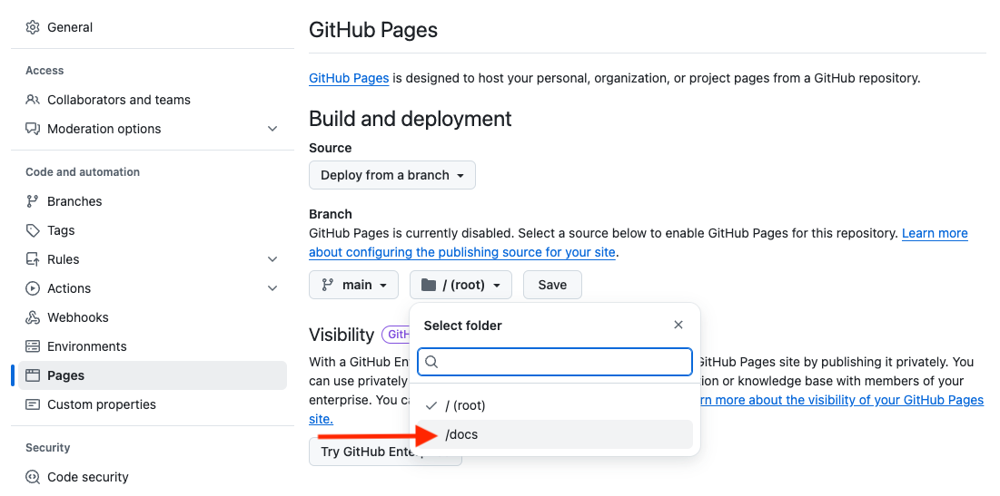
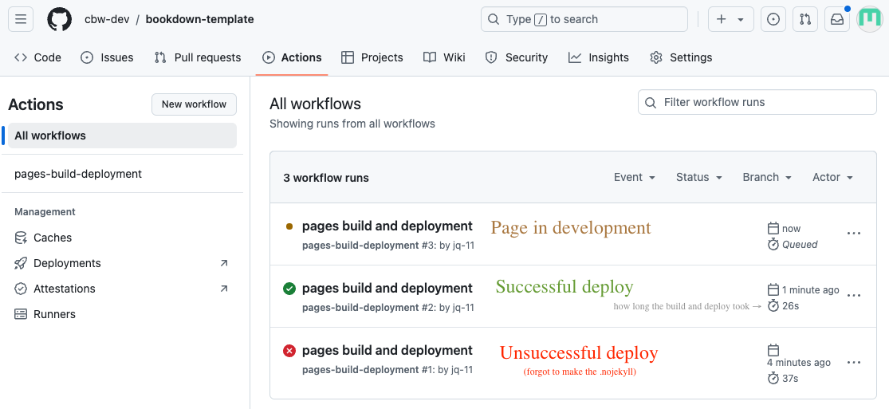
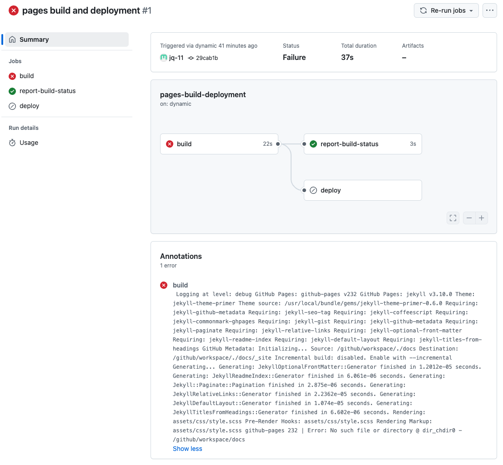

# How to Deploy Your Workshop Website

Let's recap.

We've made a bookdown project that builds into a website. We've reconfigured the output to go to a folder called "docs" (output_dir: "docs"). We've pushed our content onto github, and also made a ".nojekyll" file, which we placed into docs. 

Now in our ./docs folder, we have a bunch of html files that make up our website. We want GitHub to look at these files in the docs folder and host the website for us!

We deploy our website using GitHub pages. GitHub pages uses jekyll, so the .nojekyll file tells it to no longer rely on jekyll. Now, all we need to do is tell GitHub pages to deploy (create/update the website) from our docs folder. 

1. Go to your repo on GitHub.

2. In the top navigation bar, select settings.

3. Then, go to the pages sidebar.

4. "Deploy from a branch" is already selected, which is what we want. We must change the branch from "none" to main.

5. Then, change the folder from `/ root` to `/docs`. Then press save.

Great! Now we're waiting on the page to build and deploy, which should take less than a minute.

To see updates, go to the **Actions** page (found along the top navigation bar. This will help you understand how the deploy is working, and if it succeeded or failed.

You can click <u>**pages build and deployment**</u> for updates. It will give you errors (which may not be very clear) or the link of your deployed page!

Click around to explore more!
