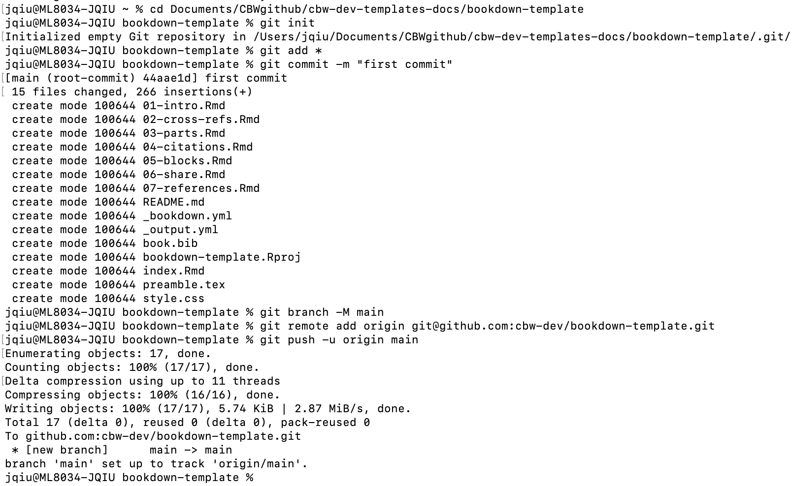
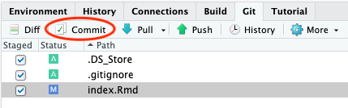
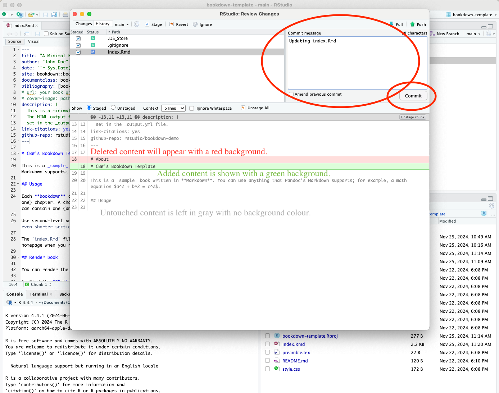

# Git Instructions

## How to Make a Git Repo (RC)

1. Go to https://github.com/cbw-dev (CHANGE?) and scroll to your repositories.

2. Click the green "New" button to the right of the repositories search bar.

3. Create the new repository. Give it a *name* and *description*. Select *Public* instead of private, as shown below.

> 🚧 Warning
>
> MAKE NAMING CONVENTION

4. Click the green *Create repository* button at the bottom.

Now, we already have a local project. Now we want it on GitHub, so everyone on your team can make changes to the workshop! Let's make the GitHub connection (i.e let's add our local code to GitHub!)

### How to Make the Git Connection (Adding your Local Repo to GitHub)

After the previous step, you will be brought to this page.The only things that will differ are the name of the repo. 

5. Open Terminal (Mac) or Command Prompt/Powershell (Windows).

6. Go to where we created the bookdown project.

7. Once inside the folder with the project. Let's make the git repo. First we initialize: `git init`. (Put this into terminal and press enter.)

8. Let's add all the files: `git add *`

9. Let's commit these files, with a descriptive message to help make it clear to others what we just did. For now, our message can be simple: `git commit -m "first commit"`. (Put this into terminal and press enter.)

10. Next, put this into terminal and press enter: `git branch -M main`. 

11. **Important:** This step is why I highlighted that specific text above. Copy that command, and put it into terminal. Generally, it will look something like this: `git remote add origin git@github.com:cbw-dev/NAME-OF-YOUR-REPO.git`

12. Next, put `git push -u origin main` into terminal and press enter.

All the steps are shown below.

## Updating GitHub via RStudio

Now, close your RStudio session, and reopen it.

Now, we will be able to see a Git window in the top right. Click "Git" to open this window.

Let's say we only edited `index.Rmd`, now we see the newly edited files. (Do not worry too much about `.DS_Store` and `.gitignore` do.) Let's try to push this change to GitHub.

13. Select all the edited files.

14. Then, click the Commit button, which appears above your selected items. A window pane will appear (shown below).

15. Add a commit message in the corresponding box, and then press commit below it.

16. A new window will show up, detailing your updates. Close this window and then press **Push** to push your updates to GitHub.

Now, we're done! We should see the updates on GitHub now. Also note, if we ever want to pull updates from GitHub, there is also a **Pull** button in the Git window within RStudio!

## How to Git Clone (ISC)
