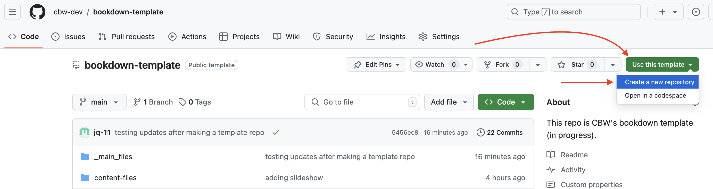
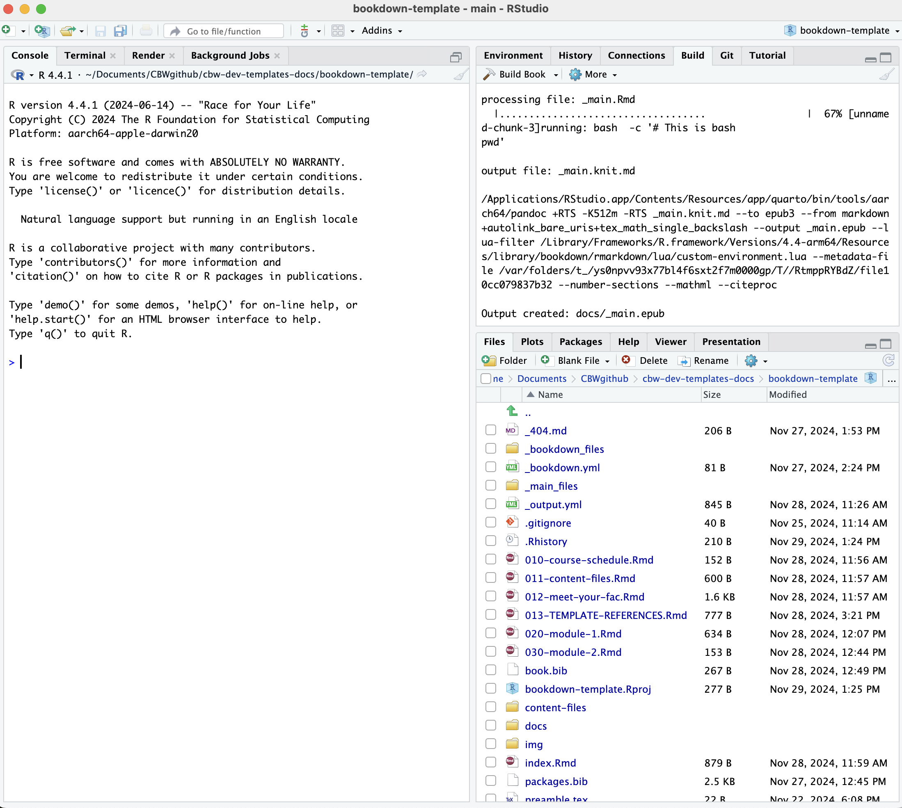

--- 
title: "CBW's Bookdown Template Documentation"
date: "`r Sys.Date()`"
site: bookdown::bookdown_site
documentclass: book
bibliography: [book.bib, packages.bib]
# url: your book url like https://bookdown.org/yihui/bookdown
# cover-image: path to the social sharing image like images/cover.jpg
description: |
  This is the (in-progress) documentation to make a bookdown CBW workshop.
  The HTML output format for this example is bookdown::gitbook,
  set in the _output.yml file.
link-citations: yes
github-repo: rstudio/bookdown-demo
favicon: img/favicon.ico
---

# CBW's Bookdown Documentation

Welcome to CBW's documentation for creating a workshop website using Bookdown. Bookdown is an R package that is used to build books, and in our case, the websites hosting CBW's workshops!

You only need to know markdown and whatever coding language you will be using to learn bookdown!

Note, this is the documentation to create a workshop using *bookdown*. If **Jupyter Book** suits you better, see [here](https://cbw-dev.github.io/jupyterbook-docs/).

If you don't know which one to use, click [here]() to learn more!

<!--chapter:end:index.Rmd-->

# Getting Started

Bookdown is an open-source R package that helps write books and articles. We will be building our bookdown-based workshop websites using this, specifically the gitbook template. (This is just the name of the specific template style, you will be working in a workshop template that CBW has prepared for you!)

If you're ready to start making a workshop website in bookdown, let's setup your device (PC, laptop)!

First, let's explain installations.

## Installation
Since bookdown is an R package, you will need R. Plus, our ideal IDE (integrated development environment i.e. the platform we will be working in) is RStudio.

1. Download and install R (You need R 3.6.0+ installed for RStudio) [here](https://cran.rstudio.com/). Follow the instructions for your operating system (Linux/macOS/Windows).
<br>
[Maybe we should have more installation instructions - a video?]

2. Download and install RStudio [here](https://posit.co/download/rstudio-desktop/#:~:text=AND%20INSTALL%20R-,2%3A%20Install%20RStudio,-DOWNLOAD%20RSTUDIO%20DESKTOP). Scroll down to find downloads for non-macOS.

3. Installl the bookdown R package: Open RStudio and in the console (in the bottom left window of RStudio) run the following command: ```install.packages("bookdown")```

We're ready to start working with CBW's bookdown workshop template now!

<!--chapter:end:01-getting-started.Rmd-->

# Starting to Set Up Your **New** Workshop

Certain aspects of the setup for workshops will be different depending on your role. Headers ending in "[RC]" are for Regional Coordinators. Headers without "[RC]" are assumed to be relevant to both RC and workshop teams.

## Workshop Setup [RC]

Regional Coordinators will be tasked with creating and slightly editing each new repository for each new workshop.

1. First, let's go the [bookdown template](https://github.com/cbw-dev/bookdown-template). 

2. Click on the "Use this template" green button, which is to the left of the title of the repository "bookdown-template". Then, press the dropdown option: "Create a new repository", as seen below.

\
<br> <!-- enforces a space after the image -->

3. You will be brought to a "Create a new repository" page. Fill out the blanks as seen below. That is, change the owner to "bioinformatics.ca" [NOTE FOR TESTING PURPOSES: use cbw-dev], make it public, fill in the repository name and description according to [CBW Guidelines](). <br>"Include all branches" does not need to be selected (???).

NOTE: CHANGE OWNER TO XXX (ask Nia, probably cbw-dev for now)
\
<br>

This may take a couple seconds to generate. After it loads, you will be brought to a new repository for the new workshop!

Now, let's turn this into a website - let's deploy!

### How to Deploy Your Workshop Website

1. In the top navigation bar, select settings.


2. Then, go to the pages sidebar.


3. "Deploy from a branch" is already selected, which is what we want. We must change the branch from "none" to main.


4. Then, change the folder from `/ root` to `/docs`. Then press save.
\

Great! Now we're waiting on the page to build and deploy, which should take less than a minute.

To see updates, go to the **Actions** page (found along the top navigation bar. This will help you understand how the deploy is working, and if it succeeded or failed.

\

You can click <u>**pages build and deployment**</u> for updates. It will give you errors (which may not be very clear) or the link of your deployed page!

\
\

INCLUDE ! ERROR DEPLOY BEFORE ANOTHER DEPLOY IS DONE

## Setting Up Team Access (Nia will fill this in)

## Getting the Template on Your Local Computer - Git Clone !

TALK ABOUT THE COMMAND LINE - CREATE CH 4 w/ terminal, but specify wont need to use since bookdown

1. navigate to where in your local file system you want to have your workshop in (hint: cd)

2. git clone git@github.com:jq-11/workshop-name.git

3. ready to go ! you should have permissions to git push

>NOTE: Consider having only one team member (or perhaps your RC) make git pushes or control pull requests. To avoid merge conflicts, designate 1 team member to control actual changes to your workshop repo. Other team members can fork or create branches, and create a pull request that the designated team member can check and overlook.

But what do any of these files mean? Which ones do I edit? Which ones shouldn't I edit? How do I open this in RStudio? It's time for you to go to the next page :D

<!--chapter:end:02-git-clone.Rmd-->

# So What Do These Files Mean?

Ok now we all have our workshop locally, which is made up of all these files and folders?

First, let's figure out RStudio. Skip to [file setup](#file-setup) if you already know how to use RStudio (and it's built in git control window).

## WORKFLOW DIAGRAM HERE


## Open in RStudio

Enter the folder you just git cloned using Findr/File Command, it should be titled "[workshop-name]". Right click on [workshop-name].Rproj and press "Open in RStudio". There is only one file with this file extension. 

A RStudio window should open up and look something like the image below. 
\

## Explaining RStudio

In the bottom left, have our console and other debug related windows (such as terminal!). Any code we run will appear in the console. We can access the terminal (just like editing in the Terminal app) under the "Terminal" tab.

In the bottom right, we have all of our files and subfolders. These files will be explained [below](#file-setup). This window also contains helpful views, like "Viewer" and "Plots". We will touch on these later.

Try opening `index.Rmd`: a new pane will open in the top left that shows the contents of `index.Rmd`. This is where we will be editing our files! Notice, the "Knit" button.

In your top right, we have a different window with more different views. The most relevant windows to us are the "Build" and the "Git" windows. 

> No "Git" Window?
>
> Try closing (and maybe even restarting RStudio) and then reopening it. A "Git" tab should appear to the right of the "Build" tab and to the left of the "Tutorial" tab.

## Build the book

Try pressing "Build Book" within the "Build" window. Your build window is going to fill up with text, and soon, a website is going to pop-up as your new window. This is the website you will be editing to create your workshop!

By building the book, all of these files were compiled and converted to .html files, that create a website. Each time we make local changes to our files and we want them to appear in our website, we need to rebuild the book. Note that each time we build our book, the files we edited will be saved first (we don't have to save before building!). 

### Other Ways to Build Your Book

1. Build the book from the R console:

```{r, eval=FALSE}
bookdown::render_book()
```

2. Press the keyboard buttons: `cmd OR ctrl + shift + B`

### Knit Your Book
Building can take a long time. If you are editing just one file, you can press the "Knit" button that is at the top of the window with your file. This will run the code in the page, and show you what that page would look like in the website (as well as saving that file).

> Note: Other pages in your website will not update.

> A quicker way to knit is using the keboard controls
>
> `cmd OR ctrl + shift + K`

### Preview Your Book

If you want live updates to your changes, you can preview the page as you edit the book when you save individual .Rmd files. You can start the server in a work session by using the RStudio add-in "Preview book", or from the R console (in the bottom left window):

```{r eval=FALSE}
bookdown::serve_book()
```

But which files do we edit? Well alas, it's time to discuss the file setup.

## File Setup Explanation {#file-setup}

[INSERT TREE ASCII] - asked IT whether I can install homebrew


To help us understand the files we're editing to make the website, let's get a full understand of how bookdown actually works.


As we touched on earlier 

## Push to GitHub via RStudio

Now, we know what our files mean and how to edit them. How do we get this onto GitHub? We can write git commands into our Terminal/Command Prompt, or alternatively (and more easily), RStudio has a built-in git interface.

Now, we will be able to see a Git window in the top right. Click "Git" to open this window.


Let's say we only edited `index.Rmd`, now we see the newly edited files. Changed files that need to be updated on GitHub will show up in this window, like how `index.Rmd` is seen above. (Do not worry too much about `.DS_Store` and `.gitignore` do.) Let's try to push this change to GitHub.

13. Select all the edited files.

\

14. Then, click the Commit button, which appears above your selected items. A window pane will appear (shown below).

\

15. Add a commit message in the corresponding box, and then press commit below it.

16. A new window will show up, detailing your updates. Close this window and then press **Push** to push your updates to GitHub.

\

Now, we're done! We should see the updates on GitHub now. Also note, if we ever want to pull updates from GitHub, there is also a **Pull** button in the Git window within RStudio! 

YOU WILL HAVE TO DO THIS IF YOUR TEAM MAKES UPDATES

This will automatically update the website, you can see the updates and progress in the actions window we saw previously.


<!--chapter:end:03-files-and-build.Rmd-->

# Storing all formatting content

- How to edit index.Rmd

## Chapters

All chapters start with a first-level heading followed by your chapter title, like the line above. There should be only one first-level heading (`#`) per .Rmd file.

## A section

All chapter sections start with a second-level (`##`) or higher heading followed by your section title, like the sections above and below here. You can have as many as you want within a chapter.

### An unnumbered section {-}

Chapters and sections are numbered by default. To un-number a heading, add a `{.unnumbered}` or the shorter `{-}` at the end of the heading, like in this section.

## Cross-references {#cross}

Cross-references make it easier for your readers to find and link to elements in your book.

## Chapters and sub-chapters

There are two steps to cross-reference any heading:

1. Label the heading: `# Hello world {#nice-label}`. 
    - Leave the label off if you like the automated heading generated based on your heading title: for example, `# Hello world` = `# Hello world {#hello-world}`.
    - To label an un-numbered heading, use: `# Hello world {-#nice-label}` or `{# Hello world .unnumbered}`.

1. Next, reference the labeled heading anywhere in the text using `\@ref(nice-label)`; for example, please see Chapter \@ref(cross). 
    - If you prefer text as the link instead of a numbered reference use: [any text you want can go here](#cross).

## Captioned figures and tables

Figures and tables *with captions* can also be cross-referenced from elsewhere in your book using `\@ref(fig:chunk-label)` and `\@ref(tab:chunk-label)`, respectively.

See Figure \@ref(fig:nice-fig).

```{r nice-fig, fig.cap='Here is a nice figure!', out.width='80%', fig.asp=.75, fig.align='center', fig.alt='Plot with connected points showing that vapor pressure of mercury increases exponentially as temperature increases.'}
par(mar = c(4, 4, .1, .1))
plot(pressure, type = 'b', pch = 19)
```

Don't miss Table \@ref(tab:nice-tab).

```{r nice-tab, tidy=FALSE}
knitr::kable(
  head(pressure, 10), caption = 'Here is a nice table!',
  booktabs = TRUE
)
```

## Parts

You can add parts to organize one or more book chapters together. Parts can be inserted at the top of an .Rmd file, before the first-level chapter heading in that same file. 

Add a numbered part: `# (PART) Act one {-}` (followed by `# A chapter`)

Add an unnumbered part: `# (PART\*) Act one {-}` (followed by `# A chapter`)

Add an appendix as a special kind of un-numbered part: `# (APPENDIX) Other stuff {-}` (followed by `# A chapter`). Chapters in an appendix are prepended with letters instead of numbers.


## Footnotes

Footnotes are put inside the square brackets after a caret `^[]`. Like this one ^[This is a footnote.]. 

## Citations

Reference items in your bibliography file(s) using `@key`.

For example, we are using the **bookdown** package [@R-bookdown] (check out the last code chunk in index.Rmd to see how this citation key was added) in this sample book, which was built on top of R Markdown and **knitr** [@xie2015] (this citation was added manually in an external file book.bib). 
Note that the `.bib` files need to be listed in the index.Rmd with the YAML `bibliography` key.


The RStudio Visual Markdown Editor can also make it easier to insert citations: <https://rstudio.github.io/visual-markdown-editing/#/citations>


## Blocks

## Equations

Here is an equation.

\begin{equation} 
  f\left(k\right) = \binom{n}{k} p^k\left(1-p\right)^{n-k}
  (\#eq:binom)
\end{equation} 

You may refer to using `\@ref(eq:binom)`, like see Equation \@ref(eq:binom).


## Theorems and proofs

Labeled theorems can be referenced in text using `\@ref(thm:tri)`, for example, check out this smart theorem \@ref(thm:tri).

::: {.theorem #tri}
For a right triangle, if $c$ denotes the *length* of the hypotenuse
and $a$ and $b$ denote the lengths of the **other** two sides, we have
$$a^2 + b^2 = c^2$$
:::

Read more here <https://bookdown.org/yihui/bookdown/markdown-extensions-by-bookdown.html>.

## Callout blocks


The R Markdown Cookbook provides more help on how to use custom blocks to design your own callouts: https://bookdown.org/yihui/rmarkdown-cookbook/custom-blocks.html


## Sharing your book

## Publishing

HTML books can be published online, see: https://bookdown.org/yihui/bookdown/publishing.html

## 404 pages

By default, users will be directed to a 404 page if they try to access a webpage that cannot be found. If you'd like to customize your 404 page instead of using the default, you may add either a `_404.Rmd` or `_404.md` file to your project root and use code and/or Markdown syntax.

## Metadata for sharing

Bookdown HTML books will provide HTML metadata for social sharing on platforms like Twitter, Facebook, and LinkedIn, using information you provide in the `index.Rmd` YAML. To setup, set the `url` for your book and the path to your `cover-image` file. Your book's `title` and `description` are also used.


This `gitbook` uses the same social sharing data across all chapters in your book- all links shared will look the same.

Specify your book's source repository on GitHub using the `edit` key under the configuration options in the `_output.yml` file, which allows users to suggest an edit by linking to a chapter's source file. 

Read more about the features of this output format here:

https://pkgs.rstudio.com/bookdown/reference/gitbook.html

Or use:

```{r eval=FALSE}
?bookdown::gitbook
```


<!--chapter:end:06-formatting-md.Rmd-->

# How to Render Code

<!--chapter:end:07-render-code.Rmd-->

# Brain Dump / FAQ


## Danger Zones

- renaming your file with this project, doesn't change the .Rprog file!


- GIT TIPS PAGE ???
- BEST PRACTICES PAGE

- MAKE SURE TO EXPLAIN WHAT HAPPENS WHEN MERGE CONFLICTS APPEAR

Ex. Forgot to pull before editing?
- Your git window will say (at the top of the window) your branch is ahead of the main branch
- You will probably have to deal with a merge conflict
- [this is pretty in-depth]

- update favicon.ico image in template with one with higher quality


## Potential Errors & Bugs

- If you get a bug where your website builds into a website that looks like it is made using very simple html, you may have to change your permissions. If you see **"Permission denied"** in your warning messages, trying running this command ```chmod -R u+w docs``` in terminal, in the folder containing your docs folder [CLARIFY ?]

- **"Could not produce X output"** - by default, bookdown builds all possible formats: gitbook, pdf, epub versions. We only need the gitbook, so if you're having issues, change your build settings to only creating the gitbook [CLARIFY + INCLUDE IMAGES]

- A very common bug is **"missing X package"**, just install it using this command in your console (the bottom left window in RStudio) ```install.packages("missing package name, include these surrouding quotations") ```

## FAQ

<!--chapter:end:08-brain-dump-faq.Rmd-->

# (PART) DEVELOPERS GUIDE {-}

# Build Site

## How to edit _bookdown.yml
- add a new line, `output_dir: "docs"` to _bookdown.yml
- build the site
- add a `.nojekyll` file into the produced docs folder

## How to edit _output.yml (RC)
- after *before:* change your workshop name link
- after *edit:* put the link to the workshop repo, and end the link with `/%s`
- save


## Mandatory “index.Rmd” landing page

Each **bookdown** chapter is an .Rmd file, and each .Rmd file can contain one (and only one) chapter. A chapter *must* start with a first-level heading: `# A good chapter`, and can contain one (and only one) first-level heading. 

Use second-level and higher headings within chapters like: `## A short section` or `### An even shorter section`.

The `index.Rmd` file is required, and is also your first book chapter. It will be the homepage when you render the book.

## Build the book:
- “Build” button in RStudio IDE /OR/ bookdown::render_book()
- Preview the book: - updates on saves in viewer window bookdown::serve_book()

Before building 

### Render book

You can render the HTML version of this example book without changing anything:

1. Find the **Build** pane in the RStudio IDE, and

1. Click on **Build Book**, then select your output format, or select "All formats" if you'd like to use multiple formats from the same book source files.

Or build the book from the R console:

```{r, eval=FALSE}
bookdown::render_book()
```

To render this example to PDF as a `bookdown::pdf_book`, you'll need to install XeLaTeX. You are recommended to install TinyTeX (which includes XeLaTeX): <https://yihui.org/tinytex/>.

### Preview book

As you work, you may start a local server to live preview this HTML book. This preview will update as you edit the book when you save individual .Rmd files. You can start the server in a work session by using the RStudio add-in "Preview book", or from the R console:

```{r eval=FALSE}
bookdown::serve_book()
```


<!--chapter:end:90-build-site.Rmd-->

# Git Instructions

## How to Make a Git Repo (RC)

1. Go to https://github.com/cbw-dev (CHANGE?) and scroll to your repositories.

2. Click the green "New" button to the right of the repositories search bar.

3. Create the new repository. Give it a *name* and *description*. Select *Public* instead of private, as shown below.

> 🚧 Warning
>
> MAKE NAMING CONVENTION


4. Click the green *Create repository* button at the bottom.

Now, we already have a local project. Now we want it on GitHub, so everyone on your team can make changes to the workshop! Let's make the GitHub connection (i.e let's add our local code to GitHub!)

### How to Make the Git Connection (Adding your Local Repo to GitHub)

After the previous step, you will be brought to this page.The only things that will differ are the name of the repo. 


5. Open Terminal (Mac) or Command Prompt/Powershell (Windows).

6. Go to where we created the bookdown project.

7. Once inside the folder with the project. Let's make the git repo. First we initialize: `git init`. (Put this into terminal and press enter.)

8. Let's add all the files: `git add *`

9. Let's commit these files, with a descriptive message to help make it clear to others what we just did. For now, our message can be simple: `git commit -m "first commit"`. (Put this into terminal and press enter.)

10. Next, put this into terminal and press enter: `git branch -M main`. 

11. **Important:** This step is why I highlighted that specific text above. Copy that command, and put it into terminal. Generally, it will look something like this: `git remote add origin git@github.com:cbw-dev/NAME-OF-YOUR-REPO.git`

12. Next, put `git push -u origin main` into terminal and press enter.

All the steps are shown below.


## Updating GitHub via RStudio

Now, close your RStudio session, and reopen it.

Now, we will be able to see a Git window in the top right. Click "Git" to open this window.


Let's say we only edited `index.Rmd`, now we see the newly edited files. (Do not worry too much about `.DS_Store` and `.gitignore` do.) Let's try to push this change to GitHub.

13. Select all the edited files.


14. Then, click the Commit button, which appears above your selected items. A window pane will appear (shown below).


15. Add a commit message in the corresponding box, and then press commit below it.

16. A new window will show up, detailing your updates. Close this window and then press **Push** to push your updates to GitHub.


Now, we're done! We should see the updates on GitHub now. Also note, if we ever want to pull updates from GitHub, there is also a **Pull** button in the Git window within RStudio!

<!--chapter:end:91-repo.Rmd-->

# How to Deploy Your Workshop Website

Let's recap.

We've made a bookdown project that builds into a website. We've reconfigured the output to go to a folder called "docs" (output_dir: "docs"). We've pushed our content onto github, and also made a ".nojekyll" file, which we placed into docs. 

Now in our ./docs folder, we have a bunch of html files that make up our website. We want GitHub to look at these files in the docs folder and host the website for us!

We deploy our website using GitHub pages. GitHub pages uses jekyll, so the .nojekyll file tells it to no longer rely on jekyll. Now, all we need to do is tell GitHub pages to deploy (create/update the website) from our docs folder. 

1. Go to your repo on GitHub.

2. In the top navigation bar, select settings.


3. Then, go to the pages sidebar.


4. "Deploy from a branch" is already selected, which is what we want. We must change the branch from "none" to main.


5. Then, change the folder from `/ root` to `/docs`. Then press save.


Great! Now we're waiting on the page to build and deploy, which should take less than a minute.

To see updates, go to the **Actions** page (found along the top navigation bar. This will help you understand how the deploy is working, and if it succeeded or failed.


You can click <u>**pages build and deployment**</u> for updates. It will give you errors (which may not be very clear) or the link of your deployed page!


Click around to explore more!

<!--chapter:end:92-deploy.Rmd-->

